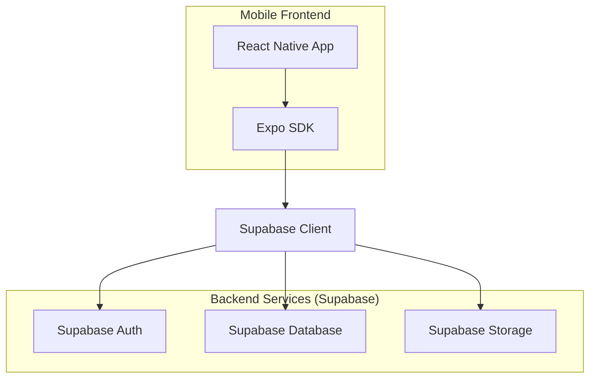
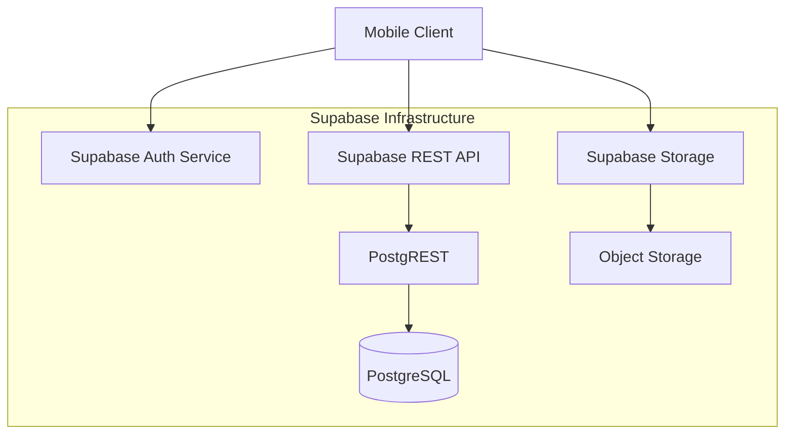
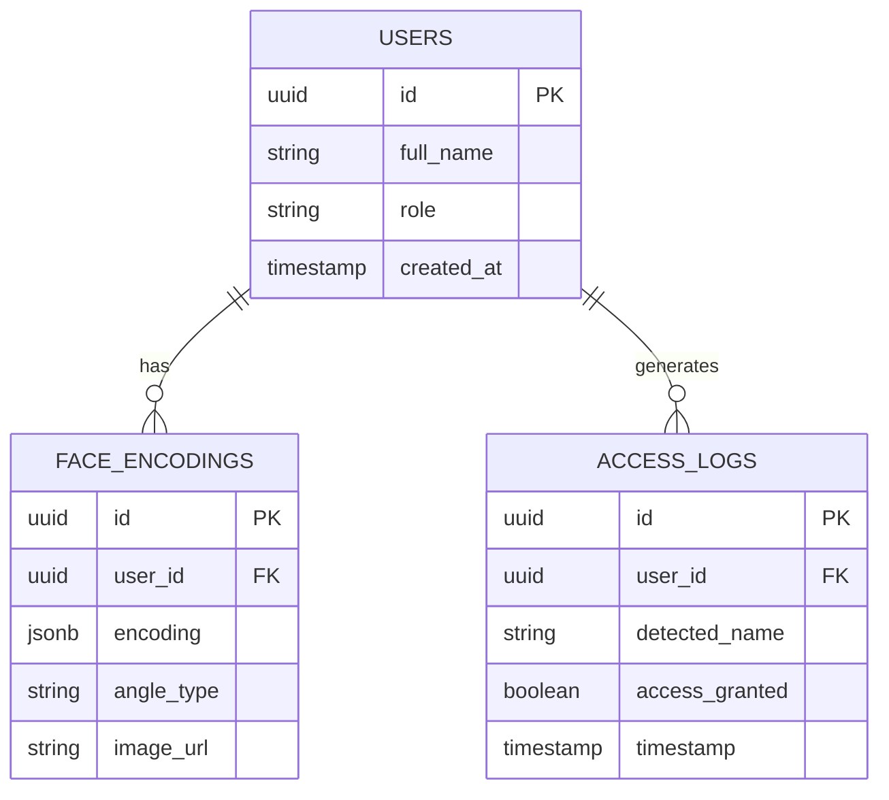

## 1. Architecture design



## 2. Technology Description

- **Frontend**: React Native + Expo SDK
- **Initialization Tool**: expo-init
- **Backend**: Supabase (Auth + PostgreSQL + Storage)
- **Dependencies esenciales**:
  - @supabase/supabase-js
  - expo-camera
  - expo-image-picker
  - react-native-paper (UI components)
  - @react-navigation/native

## 3. Route definitions

| Route | Purpose |
|-------|---------|
| /login | Pantalla de autenticación con email y contraseña |
| /register | Formulario de registro para nuevos usuarios |
| /dashboard | Panel principal con acceso a todas las funciones |
| /users | Lista de usuarios con filtros y gestión |
| /user/new | Formulario de registro de nuevo usuario |
| /user/:id/photos | Captura de fotos biométricas del usuario |
| /logs | Visualización de logs de acceso |

## 4. API definitions

### 4.1 Authentication APIs

**Login**
```
POST /auth/v1/token
```

Request:
| Param Name| Param Type  | isRequired  | Description |
|-----------|-------------|-------------|-------------|
| email     | string      | true        | Email del usuario |
| password  | string      | true        | Contraseña |

Response: JWT token de Supabase Auth

**Register**
```
POST /auth/v1/signup
```

Request:
| Param Name| Param Type  | isRequired  | Description |
|-----------|-------------|-------------|-------------|
| email     | string      | true        | Email del usuario |
| password  | string      | true        | Contraseña |
| full_name | string      | true        | Nombre completo |

### 4.2 Database APIs

**Get Users**
```
GET /rest/v1/users
```

Query params:
| Param Name| Param Type  | Description |
|-----------|-------------|-------------|
| select    | string      | Columnas a seleccionar |
| full_name | string      | Filtro por nombre (ilike) |
| role      | string      | Filtro por rol |

**Create User**
```
POST /rest/v1/users
```

**Upload Face Encoding**
```
POST /rest/v1/face_encodings
```

**Get Access Logs**
```
GET /rest/v1/access_logs
```

## 5. Server architecture diagram



## 6. Data model

### 6.1 Data model definition



### 6.2 Data Definition Language

**Users Table**
```sql
-- Tabla ya creada por usuario
CREATE TABLE users (
  id uuid default gen_random_uuid() primary key,
  full_name text not null,
  role text check (role in ('admin', 'whitelist', 'blacklist', 'visitor')),
  created_at timestamp with time zone default timezone('utc'::text, now())
);

-- Índices para búsquedas
CREATE INDEX idx_users_role ON users(role);
CREATE INDEX idx_users_full_name ON users(full_name);

-- Políticas RLS
ALTER TABLE users ENABLE ROW LEVEL SECURITY;

-- Permitir lectura a usuarios autenticados
CREATE POLICY "Allow read access" ON users FOR SELECT 
  USING (auth.role() = 'authenticated');

-- Permitir inserción solo a admins
CREATE POLICY "Allow insert for admins" ON users FOR INSERT 
  WITH CHECK (auth.uid() IN (SELECT id FROM users WHERE role = 'admin'));
```

**Face Encodings Table**
```sql
-- Índices para búsquedas rápidas
CREATE INDEX idx_face_encodings_user_id ON face_encodings(user_id);
CREATE INDEX idx_face_encodings_angle ON face_encodings(angle_type);

-- Políticas RLS
ALTER TABLE face_encodings ENABLE ROW LEVEL SECURITY;

-- Permitir operaciones a usuarios autenticados
CREATE POLICY "Allow CRUD for authenticated" ON face_encodings 
  FOR ALL USING (auth.role() = 'authenticated');
```

**Access Logs Table**
```sql
-- Índices para consultas de logs
CREATE INDEX idx_access_logs_user_id ON access_logs(user_id);
CREATE INDEX idx_access_logs_timestamp ON access_logs(timestamp DESC);
CREATE INDEX idx_access_logs_granted ON access_logs(access_granted);

-- Políticas RLS
ALTER TABLE access_logs ENABLE ROW LEVEL SECURITY;

-- Permitir inserción a cualquiera (para escaneos)
CREATE POLICY "Allow insert for all" ON access_logs FOR INSERT 
  WITH CHECK (true);

-- Permitir lectura a usuarios autenticados
CREATE POLICY "Allow read access" ON access_logs FOR SELECT 
  USING (auth.role() = 'authenticated');
```