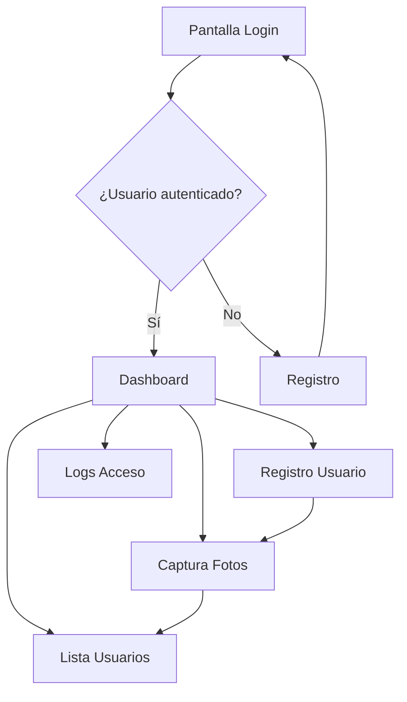

## 1. Product Overview
BioGuard es una aplicación móvil de escaneo biométrico facial que permite el control de acceso mediante reconocimiento facial. 
- Soluciona el problema de control de acceso seguro sin necesidad de credenciales físicas. 
- Dirigido a administradores de seguridad y usuarios visitantes. 
- Valor de mercado: Sistema de control de acceso biométrico para empresas e instituciones.

## 2. Core Features

### 2.1 User Roles
| Role | Registration Method | Core Permissions |
|------|---------------------|------------------|
| Admin | Pre-registrado por sistema | Gestión completa de usuarios, visualización de logs |
| Visitor | Auto-registro con email | Acceso básico, puede ser escaneado para acceso |
| Whitelist | Registro por admin | Acceso permitido al sistema |
| Blacklist | Registro por admin | Acceso denegado al sistema |

### 2.2 Feature Module
La aplicación BioGuard consta de las siguientes pantallas principales:
1. **Login**: autenticación con email y contraseña
2. **Registro**: creación de cuenta con email, contraseña y nombre
3. **Dashboard**: gestión de usuarios, visualización de logs, captura de fotos biométricas

### 2.3 Page Details
| Page Name | Module Name | Feature description |
|-----------|-------------|---------------------|
| Login | Formulario de autenticación | Ingresar email y contraseña, validación con Supabase Auth |
| Registro | Formulario de registro | Capturar nombre, email, contraseña, crear usuario tipo visitor |
| Dashboard | Lista de usuarios | Ver usuarios con filtros por nombre y estado, mostrar nombre/email/estado |
| Dashboard | Registro de usuarios | Capturar nombre, email, seleccionar estado (admin/whitelist/blacklist/visitor) |
| Dashboard | Captura biométrica | Tomar mínimo 3 fotos del usuario, almacenar encodings faciales |
| Dashboard | Logs de acceso | Visualizar historial de accesos concedidos/denegados |

## 3. Core Process
**Flujo de Administrador:**
1. Login con credenciales de admin
2. Acceso al dashboard principal
3. Opciones: ver usuarios, registrar nuevo usuario, capturar fotos biométricas
4. Al registrar usuario: completar formulario, capturar 3+ fotos, guardar encodings
5. Visualizar logs de accesos en tiempo real

**Flujo de Usuario Visitante:**
1. Auto-registro con email y contraseña
2. Esperar aprobación de admin
3. Acceso limitado según estado asignado

## 4. User Interface Design

### 4.1 Design Style
- **Colores primarios**: Azul seguridad (#1E3A8A), Blanco (#FFFFFF)
- **Colores secundarios**: Verde acceso (#10B981), Rojo denegado (#EF4444)
- **Estilo de botones**: Redondeados con sombras suaves, efecto hover
- **Tipografía**: System fonts nativos (SF Pro iOS, Roboto Android)
- **Layout**: Card-based con navegación inferior tipo tab bar
- **Iconos**: Material Design Icons para consistencia

### 4.2 Page Design Overview
| Page Name | Module Name | UI Elements |
|-----------|-------------|-------------|
| Login | Formulario | Inputs redondeados, botón azul principal, logo centrado arriba |
| Registro | Formulario | Campos apilados verticalmente, validación en tiempo real |
| Dashboard | Lista usuarios | Cards horizontales con avatar, nombre, email, badge de estado color-coded |
| Dashboard | Formulario registro | Campos en grid 2x2, selector dropdown para estado |
| Dashboard | Captura fotos | Vista de cámara full-screen, overlay guía facial, botón captura circular |

### 4.3 Responsiveness
Mobile-first nativo con adaptación automática a diferentes tamaños de pantalla. Optimizado para interacción táctil con áreas de toque mínimas de 44x44px.

### 4.4 3D Scene Guidance
No aplica - La aplicación utiliza cámara 2D para captura facial biométrica.